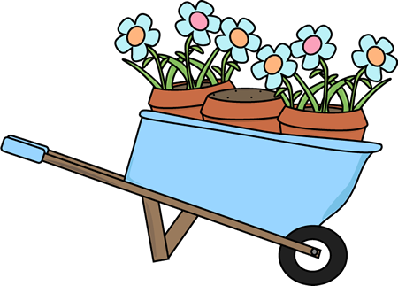

Welcome to my little Garden of a digital form. I've set this up a as my little info-dump for anything I find interesting enough to write about that isn't easily found by searching the web. Names Kenny, by the way. 

This little corner of the internet is where I write interesting things I've learned over the years and save bits of information that may come in handy for me, or even you! Have a look around and see what tickles your fancy!

Maybe [[Activate & Debloat Windows 10 & 11|Activate and Debloat your Windows installation]] or are you more in the mood for setting up [[Instructions for Docker SSH Public Key Authentication|SSH authentication using Public and Private keys]]?

Or is your mouth watering for some tasty [[Recipes]] from both near and far?

